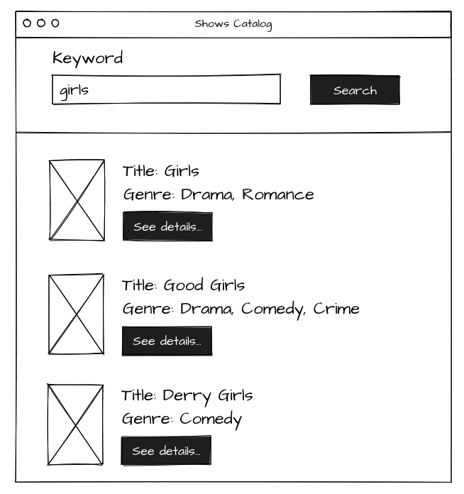
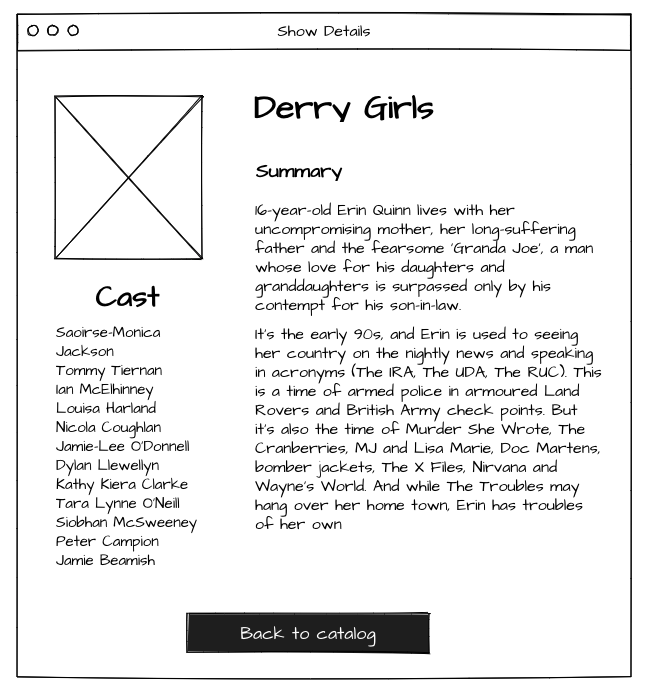

# Frontend Assignment

## To start app

#### 1. clone repository
#### 2. `npm i`
#### 3. `npm start`

## Description

Please complete a small _Shows Catalog_ application based on the UI mockup provided below.

Please use [this public API](http://www.tvmaze.com/api) to fetch the data.

## UI (mockup)

## Stack

- _TypeScript_
- _React.js_
- Preferably use _Styled Components_ for styling.

For other technologies please pick the one you like unless you can explain the choice.
